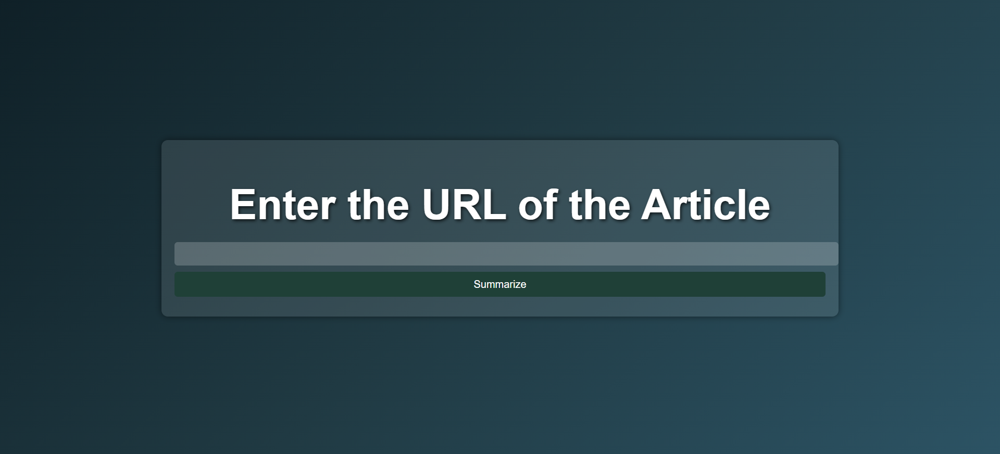
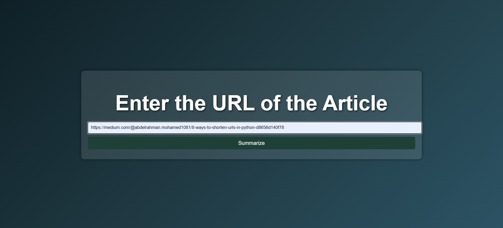
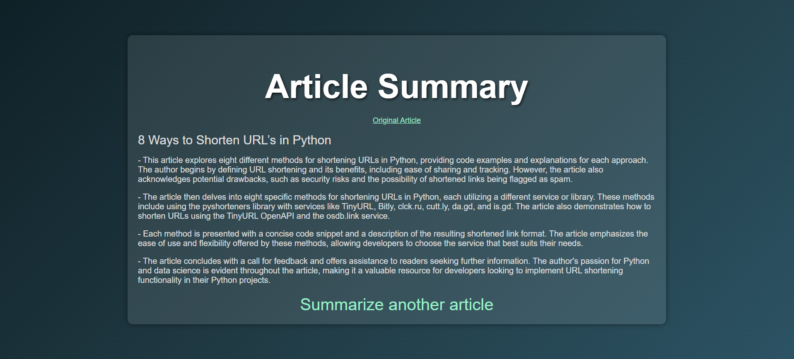

# Article Summarizer

## Home Page

This is the home page where users can start the process of summarizing an article.



## Enter the Article URL

On this page, users can enter the URL of the article they want to summarize.



## Summarized Article

After submitting the URL, the summarized article is displayed on this page.



````markdown
## Instructions

1. **Clone the repository:**
   ```sh
   git clone https://github.com/AbdooMohamedd/Article-Summarizer-with-Gemini-API.git
   ```
````

2. **Install the required packages:**

   ```sh
   pip install -r requirements.txt
   ```

3. **Generate an API key:**
   Go to [Google AI Studio](https://aistudio.google.com/app/apikey) and generate your API key.

4. **Set up the `GEMINI_API_KEY` environment variable:**

   - **On Windows:**

     1. Open Command Prompt and run:
        ```sh
        set GEMINI_API_KEY=your_api_key_here
        ```
     2. For a permanent setup:
        1. Search for "Environment Variables" in the Start Menu.
        2. Click **Edit the system environment variables** > **Environment Variables**.
        3. Add a new variable `GEMINI_API_KEY` with your API key.

   - **On macOS/Linux:**
     1. Open Terminal and run:
        ```sh
        export GEMINI_API_KEY=your_api_key_here
        ```
     2. For a permanent setup, add the line to `~/.bashrc`, `~/.bash_profile`, or `~/.zshrc`:
        ```sh
        export GEMINI_API_KEY=your_api_key_here
        ```
     3. Apply the changes:
        ```sh
        source ~/.bashrc  # or ~/.bash_profile or ~/.zshrc
        ```

5. **Run the application:**
   ```sh
   python app.py
   ```
